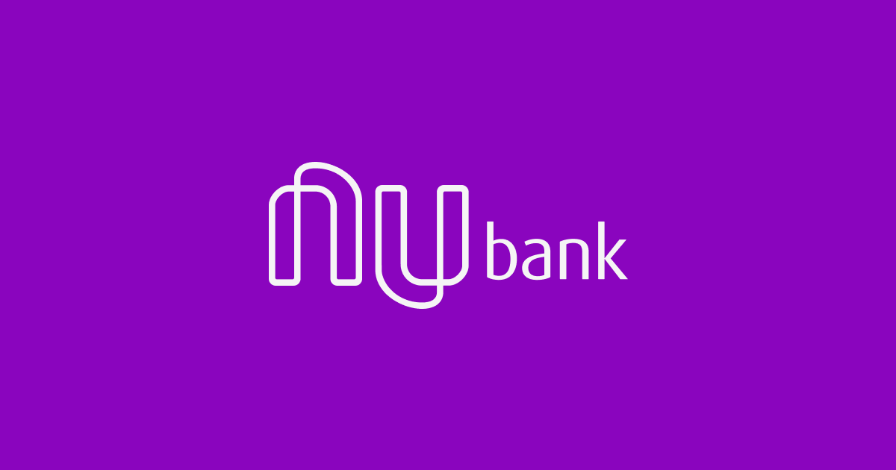
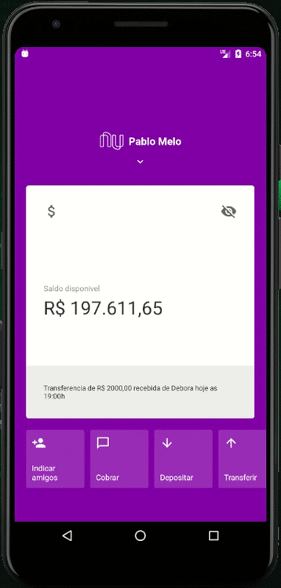

<h1 align="center">
    
</h1>

<h4 align="center">
	🚀 Clone Nubank
</h4>

  

  

  

  

  
  

## 💻 Project

This is a clone of the nubank app

<h1 align="center">
    
</h1>

## 🚀 Technologies

- [React](https://reactjs.org)

## 🚀 Get Started

- Perform the repository git clone: ​​git clone https://github.com/PabloMelo11/Nubank.git
- Open the code in VS Code and run the command: Yarn
- Open your emulator and run: react-native run-android or react-native run-ios

Made with ♥ by Pablo Melo :wave: [Get in touch!](https://www.linkedin.com/in/pablo-melo-377297161/)
